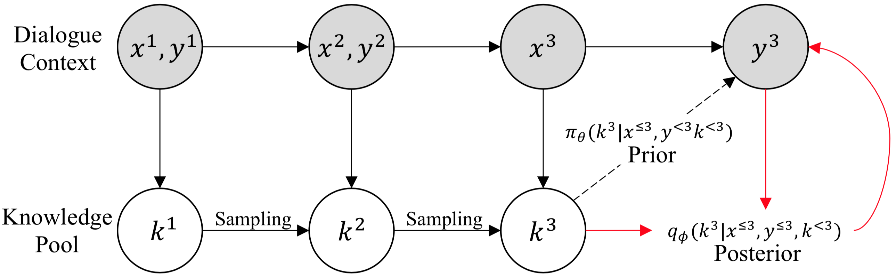

# Sequential Knowledge Transformer (SKT)



This project hosts the code and dataset for our paper.

- [Byeongchang Kim](https://bckim92.github.io/), [Jaewoo Ahn](https://ahnjaewoo.github.io/) and [Gunhee Kim](http://vision.snu.ac.kr/~gunhee/). Sequential Latent Knowledge Selection for Knowledge-Grounded Dialogue. In *ICLR* (spotlight), 2020. [[OpenReview]](https://openreview.net/forum?id=Hke0K1HKwr)

**TL;DR**: We propose a novel model named *sequential knowledge transformer* (SKT). To the best of our knowledge, our model is the first attempt to leverage a sequential latent variable model for knowledge selection, which subsequently improves knowledge-grounded chit-chat.

Please contact [Byeongchang Kim](https://bckim92.github.io/) if you have any question.

## Reference

If you use this code or dataset as part of any published research, please refer following paper,

```bibtex
@inproceedings{Kim:2020:ICLR,
    title="{Sequential Latent Knowledge Selection for Knowledge-Grounded Dialogue}",
    author={Kim, Byeongchang and Ahn, Jaewoo and Kim, Gunhee},
    booktitle={ICLR},
    year=2020
}
```

## System Requirements

- Python 3.6
- TensorFlow 2.0
- CUDA 10.0 supported GPU with at least 12GB memory
- see [requirements.yml](requirements.yml) for more details

## Running Experiments

### Wizard-of-Wikipedia

To train the model from scratch,
```bash
python train.py --cfg ymls/default.yml --gpus 0,1 SequentialKnowledgeTransformer

# To run in eager mode
python train.py --cfg ymls/default.yml --gpus 0,1 --enable_function False SequentialKnowledgeTransformer
```

To run our pretrained model,

(it will automatically download pretrained checkpoints, or you can manually download at [here](https://drive.google.com/open?id=1lkF1QENr45j0vl-Oja3wEiqkxoNTxkXT))
```bash
python inference.py --cfg ymls/default.yml --gpus 0,1 --test_mode wow SequentialKnowledgeTransformer

# Will show following results
seen
{'accuracy': 0.27305699481865287,
 'kl_loss': 0.3053756,
 'knowledge_loss': 1.7310758,
 'perplexity': 53.27382,
 'rouge1': 0.19239063597262404,
 'rouge2': 0.06829999978899365,
 'rougeL': 0.1738224486787311,
 'total_loss': 6.0118966}
unseen
{'accuracy': 0.18561958184599694,
 'kl_loss': 0.27512234,
 'knowledge_loss': 2.349341,
 'perplexity': 82.65279,
 'rouge1': 0.16114443772189488,
 'rouge2': 0.04277752138282203,
 'rougeL': 0.14518138000861658,
 'total_loss': 7.039112}
```

### Holl-E

To train the model from scratch,
```bash
python train.py --cfg ymls/holle.yml --gpus 0,1 SequentialKnowledgeTransformer
```

To run our pretrained model,

(it will automatically download pretrained checkpoints, or you can manually download at [here](https://drive.google.com/open?id=1o1-Gv5PScxlSzxW6DyZnSp3gDI5zXOhh) or [here](https://drive.google.com/open?id=13FkCjuC0aBEenlSf-NAAgOfoWVPhqFSc))
```bash
python inference.py --cfg ymls/holle.yml --gpus 0,1 --test_mode holle_1 SequentialKnowledgeTransformer

# Will show following results
{'accuracy': 0.30347923681257016,
 'kl_loss': 0.4112479,
 'knowledge_loss': 1.6464717,
 'perplexity': 51.871777,
 'rouge1': 0.29467467619580506,
 'rouge2': 0.2290895058572499,
 'rougeL': 0.28640943977431726,
 'total_loss': 6.0064945}

 # Or you can try it with another checkpoint
python inference.py --cfg ymls/holle.yml --gpus 0,1 --test_mode holle_2 SequentialKnowledgeTransformer
```

### Interactive Demo

You can have a chat with our SKT agent using following command (trained on Wizard-of-Wikipedia dataset),
```bash
python interactive.py --cfg ymls/default.yml --gpus 0 --test_mode wow SequentialKnowledgeTransformer
```


## Acknowledgement

This work was supported by SK T-Brain corporation.

## License

See [LICENSE.md](LICENSE.md).

